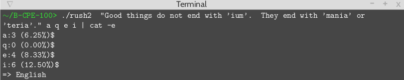
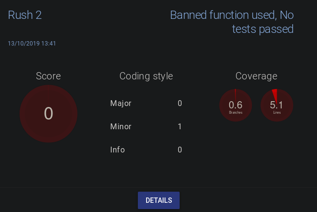

## Rush 2
> C Pool
>
> Automatically guesses the language in which a text is written (only English, French, German, and Spanish are considered), and print the occurence of the given chars in the string
>
> 1 day, 2 students, made with [Stanislas Singamy](stanislas.singamy@epitech.eu)

The longer the string, the better the results

- [Usage](#usage)
- [Example](#example)
- [Grade](#grade)

### Usage

`./rush2 STRING [CHAR]...`

### Example

Take a look at this [Wikipedia page about letters frequencies](https://en.wikipedia.org/wiki/Letter_frequency#Relative_frequencies_of_letters_in_other_languages) to understand how the program is able to deduce the language.

### Grade

This was my favorite project to do, even though I got zero :(

My solution was to read from a csv file containing each letter frequency for the 4 languages, unfortunately it was forbidden to read from a file for this project